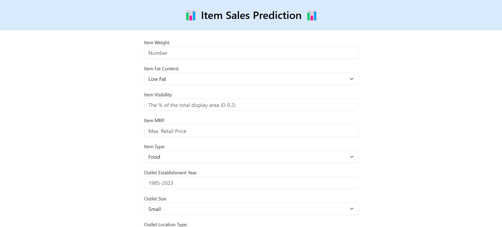
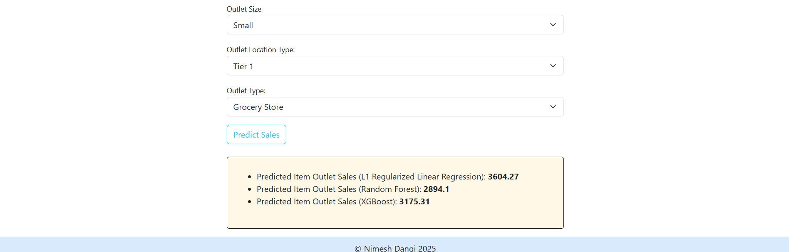

# **📊 Sales Prediction Using Linear Regression, Random Forest, and XGBoost 📊**

## **Project Overview**
- This project focuses on predicting the sales of products across various retail outlets using machine learning models. The dataset contains details from Big Mart (collected in 2013) about products, outlets, and sales. The primary objective is to build an accurate model that predicts sales (`Item_Outlet_Sales`) using features like product type, item visibility, outlet type, and other attributes.

- The project implements **Linear Regression**, **Random Forest**, and **XGBoost** models to predict sales and evaluate their performance. 
- Finally, a **Flask web application** is built to allow users to input product and outlet details and get sales predictions in real time.

---

## **Technologies Used**
- **Python**: For data preprocessing, model training, and evaluation.
- **Libraries**:
  - **pandas**, **numpy**: Data manipulation and analysis.
  - **matplotlib**, **seaborn**: Data visualization.
  - **scikit-learn**: Implementing Linear Regression and Random Forest.
  - **XGBoost**: Gradient boosting for advanced prediction.
  - **Flask**: Web framework.
- **HTML**, **CSS**: Frontend for the web application.

---

## **Dataset**
- The dataset was taken from Kaggle.
- [Link of Dataset](https://www.kaggle.com/datasets/brijbhushannanda1979/bigmart-sales-data/data)

The dataset includes the following columns:
- **Item_Identifier**: Unique product ID.
- **Item_Weight**: Weight of the product.
- **Item_Fat_Content**: Whether the product is low-fat or regular.
- **Item_Visibility**: The percentage of display area allocated to the product.
- **Item_Type**: Category of the product.
- **Item_MRP**: Maximum Retail Price of the product.
- **Outlet_Identifier**: Unique ID of the outlet/store.
- **Outlet_Establishment_Year**: Year the outlet was established.
- **Outlet_Size**: Size of the outlet.
- **Outlet_Location_Type**: Type of city where the outlet is located.
- **Outlet_Type**: Type of outlet (grocery store or supermarket).
- **Item_Outlet_Sales**: Sales of the product in the respective outlet (target variable).

---

## **Steps Involved**
The notebook used for data preprocessing and model training and hyperparameter tuning can be found [here.](./Notebook/sales_prediction.ipynb)
### **1. Data Preprocessing**
- Handled missing values (e.g., filling missing weights with mean).
- Encoded categorical variables using techniques like **One-Hot Encoding**.
- Scaled numerical features where necessary.
- Addressed outliers and ensured data was clean and ready for modeling.

### **2. Model Training**
- **Linear Regression**:
  - Simple regression model to predict sales.
  - Assumes a linear relationship between features and the target.
- **Linear Regression Regularization**:
  - Ridge Regularization (L2)
  - Lasso Regularization (L1)
- **Random Forest**:
  - Ensemble model using decision trees.
  - Handles non-linear relationships and feature interactions effectively.
- **XGBoost**:
  - Gradient boosting model for advanced predictions.
  - Optimized using hyperparameter tuning for better performance.

### **3. Model Evaluation**
- Used metrics like **R-squared** and **Root Mean Squared Error (RMSE)** to evaluate the models.
- Compared model performance:
  - **Linear Regression**:
    - RMSE: 1091.94
    - R2: 0.4825
  - **Ridge Regularized Linear Regression**:
    - RMSE: 986.48
    - R2: 0.577
  -  **Lasso Regularized Linear Regression**:
    - RMSE: 984.67
    - R2: 0.5792
  - **Random Forest**:
    - RMSE (Before Hyperparameter Tuning): 1060.23
    - R2 (Before Hyperparameter Tuning: 0.512
    - RMSE (After Hyperparameter Tuning): 994.53
    - R2 (After Hyperparameter Tuning): 0.570
  - **XGBoost**: 
    - RMSE (Before Hyperparameter Tuning): 1084.11
    - R2 (Before Hyperparameter Tuning): 0.4899
    - RMSE (After Hyperparameter Tuning): 986.66
    - R2 (After Hyperparameter Tuning): 0.577

### **4. Flask Web Application**
- Created a user-friendly **Flask** web app.
- Allows users to input product and outlet details through a form.
- Displays the predicted sales based on all the trained models.

---

## **How to Run the Project**
### **1. Clone the Repository**
```bash
git clone https://github.com/nimeshdangi/sales-prediction-using-ML.git
```

### **2. Install Dependencies**
Create a virtual environment and install the required Python libraries:
```bash
python -m venv env
source env/bin/activate  # For Windows: env\Scripts\activate
pip install -r requirements.txt
```

### **3. Run the Flask App**
Start the Flask server:
```bash
python app.py
```

---


## **Screenshots**
### **1. Web Application Form**
Users can enter details like product weight, MRP, outlet type, and more to get a sales prediction.


### **2. Prediction Output**
After submitting the form, the predicted sales are displayed.


---

## **Project Structure**
```
sales_prediction-using-ML/
├── models/
│   ├── lasso_pipeline.pkl
│   ├── rand_forest_tuned_model.pkl
│   └── xgb_tuned_model.json
├── Notebook/
│   └── sales-prediction.ipynb
├── screenshots/
│   ├── screenshot-1.png
│   └── screenshot-2.png
├── static/
│   └── styles.css
├── templates/
│   └── index.html
├── training-columns/
│   └── training_columns.pkl
├── .gitignore
├── app.py
├── README.md
└── requirements.txt
```

---
Enjoy exploring and predicting sales! 🚀